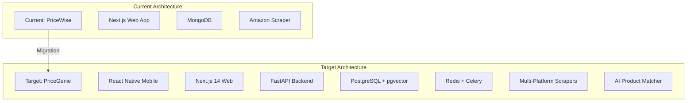

# PriceGenie Implementation Plan

## Executive Summary

**Current State**: PriceWise is a basic Next.js application with:
- Single-platform (Amazon) scraping
- MongoDB database
- Simple price tracking
- Web-only interface

**Target State**: PriceGenie is a comprehensive multi-platform shopping aggregator with:
- 5-platform scraping (Amazon UAE, Noon, Talabat, Careem, Carrefour)
- PostgreSQL + pgvector for semantic search
- React Native mobile app + Next.js web
- AI-powered product matching
- Basket optimization algorithm
- Membership-aware pricing

**Gap Analysis**: This plan bridges the gap through a phased migration approach.

---

## Architecture Overview



---

## Implementation Phases

### Phase 1: Database Migration & Foundation (Week 1-2)
**Goal**: Migrate from MongoDB to PostgreSQL with proper schema

**Tasks**:
1. Set up PostgreSQL 15 with pgvector extension
2. Create Drizzle ORM schema matching PriceGenie blueprint
3. Implement database migration scripts
4. Create seed data generator
5. Set up Redis for caching

**Deliverables**:
- PostgreSQL database with all tables
- Drizzle schema files
- Migration scripts
- Seed data with 100+ products

**Files to Create**:
```
packages/db/
├── schema/
│   ├── platforms.ts
│   ├── categories.ts
│   ├── products.ts
│   ├── raw_products.ts
│   ├── price_snapshots.ts
│   ├── users.ts
│   ├── user_memberships.ts
│   ├── user_baskets.ts
│   ├── basket_items.ts
│   └── scrape_jobs.ts
├── migrations/
│   ├── 0001_initial.sql
│   └── ...
└── seed/
    └── index.ts
```

---

### Phase 2: Backend API Migration (Week 3-4)
**Goal**: Migrate from Next.js API routes to FastAPI

**Tasks**:
1. Set up FastAPI project structure
2. Implement core API endpoints (search, products, baskets)
3. Add Pydantic models for validation
4. Implement pgvector semantic search
5. Add JWT authentication

**Deliverables**:
- FastAPI backend with core endpoints
- API documentation (OpenAPI)
- Authentication system

**Files to Create**:
```
apps/api/
├── main.py
├── routers/
│   ├── products.py
│   ├── search.py
│   ├── baskets.py
│   ├── users.py
│   └── admin.py
├── models/
│   ├── product.py
│   ├── user.py
│   └── basket.py
├── services/
│   ├── search.py
│   ├── matching.py
│   └── optimization.py
└── config.py
```

---

### Phase 3: Multi-Platform Scraping (Week 5-6)
**Goal**: Expand from Amazon-only to 5 platforms

**Tasks**:
1. Create scraper architecture with Playwright
2. Implement platform-specific scrapers:
   - Amazon UAE (refactor existing)
   - Noon
   - Talabat
   - Careem
   - Carrefour
3. Add Celery task queue
4. Implement circuit breaker pattern
5. Add proxy rotation (SmartProxy)

**Deliverables**:
- 5 working scrapers
- Celery worker setup
- Proxy rotation system
- Circuit breaker implementation

**Files to Create**:
```
services/scraper/
├── base.py
├── platforms/
│   ├── amazon_uae.py
│   ├── noon.py
│   ├── talabat.py
│   ├── careem.py
│   └── carrefour.py
├── workers.py
├── proxy_manager.py
└── circuit_breaker.py
```

---

### Phase 4: AI Product Matching (Week 7-8)
**Goal**: Implement fuzzy matching with embeddings

**Tasks**:
1. Set up sentence-transformers model
2. Generate embeddings for all products
3. Implement hybrid matching pipeline:
   - Vector similarity search
   - Fuzzy string matching (rapidfuzz)
   - Attribute comparison
4. Create manual review queue
5. Add confidence scoring

**Deliverables**:
- AI matching service
- Embedding generation pipeline
- Match confidence scoring
- Manual review interface

**Files to Create**:
```
services/matcher/
├── embedding.py
├── fuzzy_matcher.py
├── attribute_extractor.py
├── scorer.py
└── pipeline.py
```

---

### Phase 5: Basket Optimization (Week 9-10)
**Goal**: Implement combinatorial optimization algorithm

**Tasks**:
1. Implement exact DP for small baskets (≤10 items)
2. Implement greedy + local search for large baskets
3. Add membership discount logic
4. Handle minimum order requirements
5. Add shipping fee calculation

**Deliverables**:
- Optimization service
- Multiple algorithm implementations
- Membership-aware pricing
- Optimization results API

**Files to Create**:
```
services/optimizer/
├── algorithms/
│   ├── exact_dp.py
│   ├── greedy.py
│   └── local_search.py
├── calculator.py
├── membership.py
└── service.py
```

---

### Phase 6: Frontend Migration (Week 11-12)
**Goal**: Migrate Next.js frontend to new architecture

**Tasks**:
1. Update Next.js to v14 with App Router
2. Implement design system (colors, typography, animations)
3. Create shared UI components
4. Update product search UI
5. Implement basket management UI
6. Add optimization results screen

**Deliverables**:
- Updated Next.js frontend
- Design system implementation
- All core screens working

**Files to Update/Create**:
```
apps/web/
├── app/
│   ├── layout.tsx
│   ├── page.tsx
│   ├── search/
│   ├── products/
│   ├── basket/
│   └── optimize/
├── components/
│   ├── ui/
│   ├── cards/
│   └── forms/
└── lib/
    └── api.ts
```

---

### Phase 7: Mobile App Development (Week 13-16)
**Goal**: Build React Native mobile app

**Tasks**:
1. Initialize Expo React Native project
2. Implement navigation
3. Create core screens:
   - Home/Search
   - Product Details
   - Price Comparison
   - Basket
   - Optimization Results
   - Settings
4. Add animations (Moti)
5. Implement deep linking
6. Add push notifications

**Deliverables**:
- Fully functional mobile app
- All core features implemented
- Animations and polish

**Files to Create**:
```
apps/mobile/
├── app/
│   ├── _layout.tsx
│   ├── index.tsx
│   ├── search/
│   ├── products/
│   ├── basket/
│   └── settings/
├── components/
│   ├── cards/
│   ├── buttons/
│   └── inputs/
└── hooks/
```

---

### Phase 8: Deep Links & Checkout (Week 17-18)
**Goal**: Implement platform deep links

**Tasks**:
1. Create deep link generator service
2. Implement platform-specific formats:
   - Amazon UAE
   - Noon
   - Talabat
   - Careem
   - Carrefour
3. Add affiliate tracking
4. Implement click tracking
5. Add expiration logic

**Deliverables**:
- Deep link generation API
- Affiliate tracking
- Click analytics

**Files to Create**:
```
services/deeplink/
├── generator.py
├── platforms/
│   ├── amazon.py
│   ├── noon.py
│   ├── talabat.py
│   ├── careem.py
│   └── carrefour.py
└── tracker.py
```

---

### Phase 9: Testing & Security (Week 19-20)
**Goal**: Comprehensive testing and security audit

**Tasks**:
1. Implement unit tests (80% coverage)
2. Implement integration tests
3. Implement E2E tests (Playwright)
4. Security audit (OWASP Top 10)
5. Performance testing
6. Fix all vulnerabilities

**Deliverables**:
- Complete test suite
- Security audit report
- Performance benchmarks
- All vulnerabilities fixed

**Files to Create**:
```
tests/
├── unit/
├── integration/
├── e2e/
├── security/
└── performance/
```

---

### Phase 10: Deployment & Monitoring (Week 21-22)
**Goal**: Production deployment with monitoring

**Tasks**:
1. Set up cloud infrastructure (AWS/GCP)
2. Configure Kubernetes cluster
3. Set up CI/CD pipeline
4. Configure monitoring (Grafana, Prometheus)
5. Set up logging (ELK stack)
6. Configure alerts (PagerDuty)
7. Disaster recovery setup

**Deliverables**:
- Production deployment
- Monitoring dashboards
- CI/CD pipeline
- Backup and recovery

**Files to Create**:
```
infrastructure/
├── terraform/
├── kubernetes/
├── docker/
└── scripts/
```

---

## Technology Stack Migration

### Database
- **From**: MongoDB (mongoose)
- **To**: PostgreSQL 15 + pgvector + Drizzle ORM

### Backend
- **From**: Next.js API routes
- **To**: FastAPI (Python)

### Frontend
- **From**: Next.js (current version)
- **To**: Next.js 14 + React Native (Expo)

### Scraping
- **From**: Cheerio (simple HTML parsing)
- **To**: Playwright (JavaScript rendering) + Celery

### Search
- **From**: MongoDB text search
- **To**: pgvector semantic search + sentence-transformers

### Authentication
- **From**: None
- **To**: JWT + OAuth (Google, Apple)

---

## Key Challenges & Solutions

### Challenge 1: Data Migration
**Problem**: Migrating existing MongoDB data to PostgreSQL

**Solution**:
1. Create migration script to transform MongoDB schema to PostgreSQL
2. Preserve existing product data
3. Generate embeddings for existing products
4. Test migration on staging first

### Challenge 2: Scraper Blocking
**Problem**: Platforms actively block scrapers

**Solution**:
1. Implement proxy rotation (SmartProxy)
2. Add circuit breaker pattern
3. Use residential IPs
4. Respect rate limits
5. Add CAPTCHA solving (2Captcha)

### Challenge 3: Performance
**Problem**: Search and optimization need to be fast

**Solution**:
1. Use HNSW indexes for vector search
2. Cache results in Redis
3. Implement algorithm selection by basket size
4. Use connection pooling

### Challenge 4: Mobile App Complexity
**Problem**: Building mobile app from scratch

**Solution**:
1. Use Expo for rapid development
2. Share components with web via monorepo
3. Use Moti for animations
4. Implement progressive web app first

---

## Risk Assessment

| Risk | Probability | Impact | Mitigation |
|------|-------------|--------|------------|
| Scraper blocking | High | High | Proxy rotation, circuit breaker |
| Performance issues | Medium | High | Caching, indexing, algorithm selection |
| Data migration issues | Medium | Medium | Test thoroughly, backup data |
| Timeline overrun | Medium | Medium | Prioritize MVP, defer nice-to-haves |
| Budget overruns | Low | Medium | Use free tiers where possible |

---

## Success Criteria

### Technical
- ✅ All 5 platforms scraping successfully
- ✅ Search response time <3 seconds (p95)
- ✅ Basket optimization <6 seconds (p95)
- ✅ 80%+ test coverage
- ✅ Zero critical security vulnerabilities

### Business
- ✅ 10K+ products in database
- ✅ 70%+ prices fresh (<1 hour)
- ✅ Affiliate tracking working
- ✅ Mobile app in app stores

### User Experience
- ✅ Intuitive search and comparison
- ✅ Smooth basket optimization
- ✅ Fast deep link redirects
- ✅ Beautiful, consistent design

---

## Resource Requirements

### Team
- 1 Backend Developer (Python/FastAPI)
- 1 Frontend Developer (Next.js/React Native)
- 1 ML Engineer (embeddings, matching)
- 1 DevOps Engineer (infrastructure, deployment)
- 1 QA Engineer (testing, security)

### Infrastructure
- Cloud account (AWS/GCP/Azure)
- PostgreSQL database (RDS/Cloud SQL)
- Redis cache (ElastiCache/Memorystore)
- Kubernetes cluster (EKS/GKE/AKS)
- Object storage (S3/GCS)
- Monitoring (Grafana Cloud)

### Third-Party Services
- SmartProxy (residential proxies) - ~$400/mo
- 2Captcha (CAPTCHA solving) - ~$50/mo
- Anthropic Claude (AI) - ~$200/mo
- Sentry (error tracking) - ~$26/mo
- PagerDuty (alerting) - ~$20/mo

---

## Timeline Summary

| Phase | Duration | Key Deliverable |
|-------|----------|----------------|
| 1: Database Migration | 2 weeks | PostgreSQL + Drizzle schema |
| 2: Backend API | 2 weeks | FastAPI core endpoints |
| 3: Multi-Platform Scraping | 2 weeks | 5 platform scrapers |
| 4: AI Product Matching | 2 weeks | Fuzzy matching service |
| 5: Basket Optimization | 2 weeks | Optimization algorithm |
| 6: Frontend Migration | 2 weeks | Updated Next.js app |
| 7: Mobile App | 4 weeks | React Native app |
| 8: Deep Links | 2 weeks | Checkout integration |
| 9: Testing & Security | 2 weeks | Test suite + audit |
| 10: Deployment | 2 weeks | Production deployment |

**Total**: 22 weeks (~5.5 months)

---

## Next Steps

1. **Review this plan** with stakeholders
2. **Prioritize phases** based on business needs
3. **Set up infrastructure** (cloud accounts, databases)
4. **Begin Phase 1** (Database Migration)
5. **Establish CI/CD** early for automated testing

---

## Questions for Stakeholders

1. **Timeline**: Is 22 weeks acceptable, or do we need to accelerate?
2. **Budget**: What's the monthly budget for infrastructure and services?
3. **Team**: Do we have the required team members, or need to hire?
4. **MVP**: Should we launch with fewer platforms (e.g., 2 instead of 5)?
5. **Mobile**: Is mobile app critical for MVP, or can it be Phase 2?
6. **Design**: Should we implement the full design system immediately or iteratively?

---

## Appendix A: File Structure

```
price-genie/
├── apps/
│   ├── mobile/              # React Native (Expo)
│   │   ├── app/
│   │   ├── components/
│   │   └── hooks/
│   ├── web/                 # Next.js 14
│   │   ├── app/
│   │   ├── components/
│   │   └── lib/
│   └── api/                 # FastAPI
│       ├── routers/
│       ├── models/
│       ├── services/
│       └── config.py
├── packages/
│   ├── db/                  # Drizzle schema + migrations
│   │   ├── schema/
│   │   ├── migrations/
│   │   └── seed/
│   ├── ui/                  # Shared React components
│   │   ├── components/
│   │   └── styles/
│   └── shared/              # TypeScript types, utils
│       ├── types/
│       └── utils/
├── services/
│   ├── scraper/             # Playwright scraping workers
│   │   ├── platforms/
│   │   ├── workers.py
│   │   └── proxy_manager.py
│   ├── matcher/             # ML product matching
│   │   ├── embedding.py
│   │   ├── fuzzy_matcher.py
│   │   └── pipeline.py
│   ├── optimizer/           # Basket optimization
│   │   ├── algorithms/
│   │   └── calculator.py
│   └── deeplink/           # Deep link generation
│       └── platforms/
├── infrastructure/
│   ├── terraform/
│   ├── kubernetes/
│   └── docker/
├── tests/
│   ├── unit/
│   ├── integration/
│   ├── e2e/
│   ├── security/
│   └── performance/
└── docs/
    ├── IMPLEMENTATION_PLAN.md
    ├── PriceGenie_Master_Blueprint.md
    ├── design-system.md
    └── implementation-roadmap.md
```

---

**Document Version**: 1.0  
**Created**: December 31, 2025  
**Status**: Draft - Pending Review
